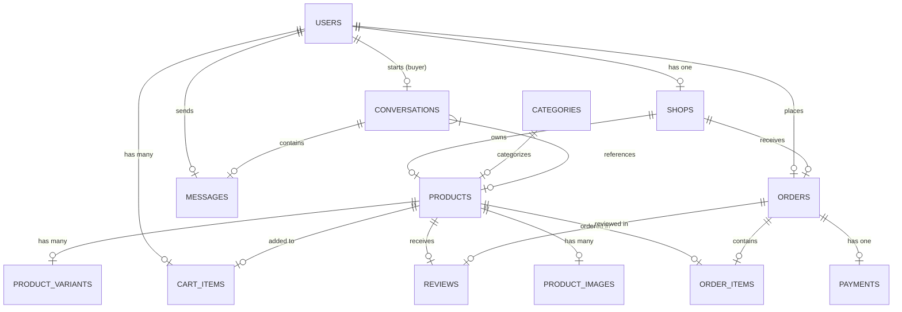

# 🎓 EduPlayHub - E-Commerce Platform & REST API

**Platform E-Commerce & Marketplace untuk Rental & Pembelian Alat Mahasiswa**

EduPlayHub adalah platform e-commerce/marketplace terintegrasi yang dirancang untuk mempermudah mahasiswa dalam menyewa (rental) maupun membeli peralatan kuliah (seperti laptop, proyektor, printer, alat laboratorium, dll.). 

Project ini menyediakan **Web Application** (menggunakan Laravel Blade untuk antarmuka pembeli & penjual) sekaligus **REST API Backend** (menggunakan Laravel 11, MySQL, dan Laravel Sanctum) yang siap dikonsumsi oleh aplikasi mobile (Android/iOS) atau frontend modern lainnya.

---

## 📋 Fitur Utama

### 🔐 1. Sistem Autentikasi
*   **Web Authentication**: Login, register, dan logout berbasis sesi web.
*   **REST API Authentication**: Keamanan endpoint menggunakan **Laravel Sanctum** (token bearer).
*   **Profile Management**: Update informasi profil, ubah password, dan upload avatar.

### 🛍️ 2. Katalog Produk & Toko (Shop)
*   **Multi-Merchant / Shop**: Pengguna dapat bertindak sebagai **Buyer** (pembeli) atau **Seller** (pemilik toko/shop).
*   **Katalog Terfilter**: Pencarian produk berdasarkan nama, deskripsi, kategori, tipe (jual/sewa), rentang harga, dan status aktif.
*   **Multi-Image & Variant**: Dukungan untuk banyak foto produk (gallery) dan varian produk (ukuran, warna, spesifikasi).
*   **SEO-Friendly URLs**: Menggunakan slug unik untuk detail produk.

### 🛒 3. Keranjang (Cart) & Voucher
*   **Manajemen Keranjang**: Tambah, ubah jumlah, hapus item, dan pilih item yang akan dicheckout.
*   **Sistem Voucher**: Klaim kode voucher untuk mendapatkan diskon belanja (persentase / nilai nominal maksimal).

### 💳 4. Checkout & Integrasi Payment Gateway (Midtrans)
*   **Dua Mode Transaksi**:
    *   **Beli (Purchase)**: Pembelian barang putus dengan pengurangan stok otomatis.
    *   **Sewa (Rental)**: Penyewaan barang dengan perhitungan tarif harian berdasarkan durasi hari sewa yang diinput.
*   **Midtrans Snap API**: Generate Snap token otomatis saat checkout untuk pembayaran instan & aman (mendukung QRIS, GoPay, ShopeePay, Virtual Account, dll.).
*   **Automated Callback Handler**: Sinkronisasi status pesanan (`pending` ➔ `paid` ➔ `expired` ➔ `cancelled`) secara otomatis melalui webhook callback Midtrans.

### 💬 5. Chat Real-Time (Buyer ➔ Seller)
*   **Ruang Obrolan Terkoneksi**: Chat langsung antara pembeli dan pemilik toko terkait produk tertentu.
*   **Attachment Upload**: Dukungan pengiriman pesan teks serta berkas dokumen/gambar sebagai lampiran chat.
*   **Unread Badges**: Indikator pesan yang belum dibaca dan fitur mark-as-read.

### 📝 6. Ulasan & Penilaian (Reviews)
*   **Rating & Ulasan**: Pembeli dapat memberikan penilaian (bintang 1-5) dan testimoni tertulis untuk produk yang telah selesai dibeli/disewa.

---

## 🛠️ Tech Stack

| Komponen | Teknologi |
| :--- | :--- |
| **Backend Framework** | Laravel 11.x |
| **Database** | MySQL 8.0+ |
| **Language** | PHP 8.2+ |
| **Authentication** | Laravel Sanctum & Web Guard |
| **Payment Gateway** | Midtrans Snap API |
| **Frontend/Views** | Blade Templates, Vanilla CSS, Vite |
| **API Format** | RESTful JSON |

---

## 🗄️ Database Schema & Models

Database terdiri dari 14 tabel yang saling berelasi secara erat melalui Eloquent ORM:



### Penjelasan Tabel Utama:
*   `users`: Menyimpan kredensial pengguna, alamat, nomor telepon, dan peran (`buyer` atau `seller`).
*   `shops`: Informasi toko milik seller (nama toko, deskripsi, saldo, rating toko).
*   `categories`: Kategori produk (misal: Elektronik, Kamera, Alat Lab).
*   `products`: Detail produk, tipe transaksi (`rentable`/`sellable`), harga jual/sewa, lokasi, dan stok.
*   `cart_items`: Keranjang belanja temporer pengguna sebelum melakukan checkout.
*   `orders`: Data transaksi induk (nomor order, total harga, status pembayaran Midtrans, alamat pengiriman, tipe transaksi).
*   `order_items`: Detail produk yang dibeli/disewa pada suatu transaksi.
*   `vouchers`: Kupon diskon aktif yang dapat digunakan pembeli.
*   `conversations` & `messages`: Menyimpan riwayat chat dan file attachment antara buyer dan seller.
*   `reviews`: Penilaian bintang dan ulasan produk oleh pembeli.

---

## 📁 Struktur Folder Project

```
eduplay-backend/
├── app/
│   ├── Http/
│   │   ├── Controllers/
│   │   │   ├── Api/                     # REST API Controllers (Sanctum)
│   │   │   │   ├── AuthController.php
│   │   │   │   ├── CategoryController.php
│   │   │   │   ├── ChatController.php
│   │   │   │   ├── ProductController.php
│   │   │   │   ├── ReviewController.php
│   │   │   │   └── TransactionController.php
│   │   │   ├── AuthController.php       # Web Auth Controller
│   │   │   ├── CartController.php       # Web Cart Controller
│   │   │   ├── CatalogController.php    # Web Catalog Controller
│   │   │   ├── CheckoutController.php   # Web Checkout Controller
│   │   │   ├── MidtransController.php   # Midtrans Webhook Callback
│   │   │   └── SellerController.php     # Web Seller Dashboard
│   │   └── Requests/                    # Form Validation Requests
│   ├── Models/                          # Eloquent Models (User, Product, Order, dll)
│   └── Services/
│       └── MidtransService.php          # SDK Integration & Signature Verifier
├── config/                              # Configuration files (services.php, database.php)
├── database/
│   ├── migrations/                      # Database Schema Migrations
│   └── seeders/                         # Seeders untuk Sample Users, Shop & Products
├── resources/
│   ├── views/                           # Blade Templates untuk Web Frontend
│   └── css/                             # Stylesheets
├── routes/
│   ├── api.php                          # REST API Routes
│   └── web.php                          # Web Application Routes
├── SETUP_GUIDE.md                       # Panduan instalasi mandiri
├── API_RESPONSE_EXAMPLES.md            # Contoh response API
└── EduPlayHub_API.postman_collection.json
```

---

## 🚀 Panduan Instalasi & Setup Quickstart

### Prerequisites
Pastikan perangkat Anda sudah terinstal:
*   PHP 8.2 atau lebih tinggi
*   Composer
*   MySQL Database Server (XAMPP / Laragon / Docker)
*   Node.js & NPM (opsional, untuk build aset Vite)

### Langkah-langkah:

1.  **Clone Repository**
    ```bash
    git clone https://github.com/DIMFAQ/EduPlayHub.git
    cd EduPlayHub
    ```

2.  **Instal Dependensi PHP**
    ```bash
    composer install
    ```

3.  **Salin & Konfigurasi `.env`**
    ```bash
    cp .env.example .env
    ```
    Buka file `.env` dan sesuaikan koneksi database Anda:
    ```env
    DB_CONNECTION=mysql
    DB_HOST=127.0.0.1
    DB_PORT=3306
    DB_DATABASE=eduplayhub
    DB_USERNAME=root
    DB_PASSWORD=
    ```

4.  **Konfigurasi Kredensial Midtrans** (Dapatkan dari Dashboard Sandbox Midtrans Anda):
    ```env
    MIDTRANS_SERVER_KEY=your_sandbox_server_key_here
    MIDTRANS_CLIENT_KEY=your_sandbox_client_key_here
    MIDTRANS_IS_PRODUCTION=false
    MIDTRANS_IS_SANITIZED=true
    MIDTRANS_IS_3DS=true
    ```

5.  **Generate Application Key**
    ```bash
    php artisan key:generate
    ```

6.  **Jalankan Migration & Seeders**
    Langkah ini akan membuat seluruh tabel database dan mengisinya dengan data awal (kategori, beberapa produk demo, user uji coba, dan voucher):
    ```bash
    php artisan migrate --fresh --seed
    ```

7.  **Buat Symbolic Link Storage**
    Diperlukan agar file gambar yang diupload ke direktori storage dapat diakses publik melalui URL:
    ```bash
    php artisan storage:link
    ```

8.  **Jalankan Server Lokal**
    ```bash
    php artisan serve
    ```
    Server akan berjalan di: **[http://localhost:8000](http://localhost:8000)**

---

## 📚 API Endpoints (REST API)

Endpoint ini dilindungi oleh autentikasi token Sanctum kecuali pada rute publik. Gunakan header `Authorization: Bearer <your_token>` untuk rute terproteksi.

### 🔐 1. Autentikasi (`/api/auth`)
| Method | Endpoint | Deskripsi | Auth? |
| :--- | :--- | :--- | :--- |
| `POST` | `/api/auth/register` | Mendaftarkan akun pembeli/penjual baru | ❌ |
| `POST` | `/api/auth/login` | Login & mendapatkan Bearer Token | ❌ |
| `POST` | `/api/auth/logout` | Revoke token aktif saat ini | ✅ |
| `GET` | `/api/auth/me` | Mendapatkan data informasi user saat ini | ✅ |
| `PUT` | `/api/auth/profile` | Mengubah informasi profil user | ✅ |
| `POST` | `/api/auth/avatar` | Upload foto profil baru (avatar) | ✅ |

### 📦 2. Produk & Kategori (`/api/products` & `/api/categories`)
| Method | Endpoint | Deskripsi | Auth? |
| :--- | :--- | :--- | :--- |
| `GET` | `/api/categories` | Mendapatkan semua kategori produk | ❌ |
| `GET` | `/api/products` | Mendapatkan list produk (support filter & search) | ❌ |
| `GET` | `/api/products/{slug}` | Mendapatkan detail produk berdasarkan slug | ❌ |

### 💳 3. Transaksi (`/api/transactions`)
| Method | Endpoint | Deskripsi | Auth? |
| :--- | :--- | :--- | :--- |
| `GET` | `/api/transactions` | Mendapatkan riwayat transaksi pengguna (paginate) | ✅ |
| `POST` | `/api/transactions` | Membuat checkout baru & mendapatkan Midtrans Snap Token | ✅ |
| `GET` | `/api/transactions/{id}` | Mendapatkan detail informasi transaksi | ✅ |
| `PATCH` | `/api/transactions/{id}/cancel` | Membatalkan transaksi pending | ✅ |
| `GET` | `/api/transactions/{id}/status`| Cek status transaksi & pembayaran | ✅ |

### 💬 4. Obrolan / Chat (`/api/chats`)
| Method | Endpoint | Deskripsi | Auth? |
| :--- | :--- | :--- | :--- |
| `GET` | `/api/chats` | Mendapatkan daftar obrolan aktif (Rooms) | ✅ |
| `POST` | `/api/chats` | Membuka/membuat chat room baru dengan seller produk | ✅ |
| `GET` | `/api/chats/{roomId}/messages`| Mendapatkan riwayat pesan di dalam room chat | ✅ |
| `POST` | `/api/chats/{roomId}/messages`| Mengirim pesan teks baru ke room | ✅ |
| `POST` | `/api/chats/{roomId}/upload` | Mengunggah file attachment di room chat | ✅ |
| `PATCH`| `/api/chats/{roomId}/read` | Menandai seluruh pesan masuk sebagai telah dibaca | ✅ |

### 📝 5. Ulasan Produk (`/api/reviews`)
| Method | Endpoint | Deskripsi | Auth? |
| :--- | :--- | :--- | :--- |
| `GET` | `/api/products/{productId}/reviews`| Mendapatkan semua rating & ulasan suatu produk | ❌ |
| `POST` | `/api/reviews` | Membuat ulasan baru untuk produk yang telah dibeli/sewa | ✅ |

### 🔔 6. Webhook Midtrans Callback
| Method | Endpoint | Deskripsi | Auth? |
| :--- | :--- | :--- | :--- |
| `POST` | `/api/midtrans/callback` | Endpoint tujuan callback dari Midtrans (IPN) | ❌ |

---

## 💻 Rute Web Utama (Web Application)

Selain API, Anda dapat membuka browser untuk menguji alur aplikasi web lengkap (menggunakan file Blade template):

*   **Halaman Utama (Welcome)**: `GET /`
*   **Autentikasi**: `GET /login` dan `GET /register`
*   **Buyer Flow (Memerlukan Login)**:
    *   Katalog & Detail Produk: `/katalog` ➔ `/produk/{id}`
    *   Keranjang Belanja: `/keranjang`
    *   Checkout & Midtrans Pay: `/checkout`
    *   Daftar Transaksi Pembeli: `/pesanan`
    *   Buyer Chat: `/chat`
*   **Seller Flow (Memerlukan Login & Akun Seller)**:
    *   Seller Dashboard: `/seller/dashboard`
    *   Kelola Produk Toko: `/seller/produk`
    *   Kelola Pesanan Masuk: `/seller/pesanan`
    *   Seller Chat: `/seller/chat`

---

## 🧪 Pengujian Menggunakan Postman

Telah disediakan file collection Postman untuk mempermudah proses testing seluruh endpoint API:
1.  Buka aplikasi **Postman**.
2.  Klik tombol **Import** di kiri atas.
3.  Pilih file `EduPlayHub_API.postman_collection.json` di root directory project ini.
4.  Gunakan akun uji coba berikut (dari hasil database seeding):
    *   **Email**: `test@example.com` (atau akun seeder lain)
    *   **Password**: `password`

---

## 🐛 Troubleshooting

*   **Error: "Table doesn't exist"**:
    Pastikan database server Anda aktif, nama database di `.env` sudah benar, dan jalankan perintah `php artisan migrate --fresh --seed`.
*   **Error: "Unauthorized" pada Rute API**:
    Pastikan Anda melampirkan header `Authorization: Bearer <token_anda>` yang didapatkan dari response `POST /api/auth/login`.
*   **Error: Storage link tidak berfungsi**:
    Di Windows, jalankan command prompt sebagai Administrator saat mengeksekusi `php artisan storage:link` jika mengalami kendala pembuatan symbolic link.

---

## 📄 License
Project open-source ini ditujukan untuk kebutuhan akademis mata kuliah E-Business.

Last Updated: May 30, 2026
